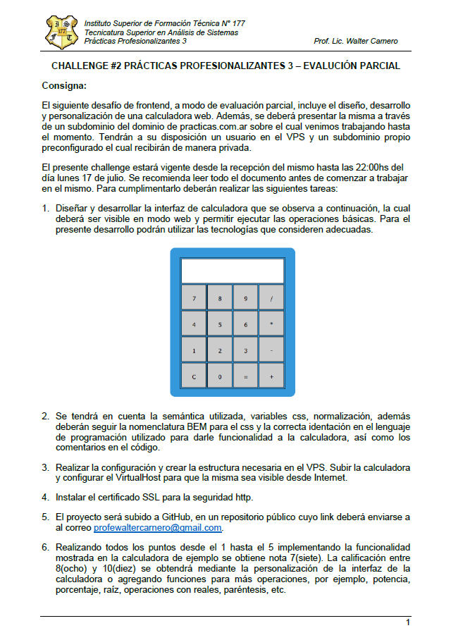

<h1 style="text-align: center;"> PP3_Challenge2Parcial </h1>

## Primer parcial de practicas profesionalizantes
### Consigna:

# Desarrollo
#### Para el desarrollo de las funciones matemáticas se utiliza la librería [mathjs](https://mathjs.org/index.html):
   

 
Se decide utilizar esta librería ya que contiene entre otras la funcionalidad para poder evaluar un expresión 
   lo que simplifica el desarrollo.

#### Las operaciones soportadas son:

La función m+ captura el resultado actual y lo guarda en el local storage para poder recuperarse con la operación Ans.

# Cambios realizados en el Servidor
1) Se ingresó al server con las credenciales provistas.
2) Se cambió la contraseña
3) Se creó la carpeta /home/jorge/www
4) Se creó y configuró el VirtualHost en /etc/apache2/sites.available con el nombre jorge.practicas.com.ar.conf con la configuración adecuada.
5) Se encendió el virtualhost: __sudo a2ensite jorge.practicas.com.ar.conf__
6) Se recargó apache: ***_sudo systemctl reload apache2_***
7) Se agregó al usuario jorge al grupo de www-data: ___sudo usermod -g www-data jorge___
8) Se cambiaron los permisos a la carpeta /home/jorge/www: __sudo chmod 755 /home/jorge/www__
9) Ubicado en /etc/apache2/sites-available se ejcutó el comando: ***_sudo certbot --apache -g jorge.practicas.com.ar_*** y se seleccionó la opción 2 redirect. Una vez finalizado se crearon los certificados:
   * _/etc/letsencrypt/live/jorge.practicas.com.ar/fullchain.pem_
   * _/etc/letsencrypt/live/jorge.practicas.com.ar/privkey.pem_
10) Se creo el cron para poder renovar automáticamente el certificado:
11) Se creó el script con el comando:
    #### sudo nano /etc/cron.daily/certbot-renew
12) Dentro del archivo creado se incluyeron las siguientes líneas:
     #!/bin/sh
     if certbot renew > /var/log/letsencrypt/renew.log 2>&1 ; then
     /etc/init.d/apache2 reload >> /var/log/letsencrypt/renew.log
     fi
     exit
13) Se dió permiso de ejecución al script:
   #### sudo chmod +x /etc/cron.daily/certbot-renew
14) Se configuró el cron job ejecutando el comando:
   #### sudo crontab -e
   De los posibles editores indicados se seleccionó nano.  
   Agregó la configuración para que se ejecute diariamente en las horas y minutos como se indica a continuación:
   #### 01 01,13 * * * /etc/cron.daily/certbot-renew
15) Se guardaron los cambios y al salir del editor el cron job quedó en ejecución 

Luego de estos pasos se pudo acceder a: https://jorge.practicas.com.ar